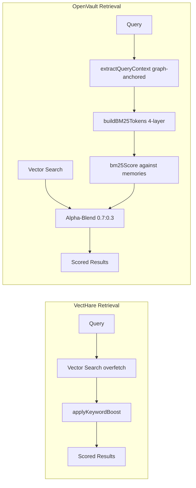

# VectHare vs OpenVault: Keyword Extraction Comparison Plan

## 1. Executive Summary

Both VectHare and OpenVault are vector memory systems for SillyTavern that use keyword/BM25 techniques to enhance retrieval. However, they take **fundamentally different architectural approaches** to keyword usage, and handle **CJK text dramatically differently**. This plan outlines a methodology to compare keyword quality between the two systems using the provided Chinese/English bilingual roleplay test story.

---

## 2. Architecture Comparison

### 2.1 When Keywords Are Generated

| Aspect | VectHare | OpenVault |
|--------|----------|-----------|
| **Timing** | At **vectorization time** per-chunk, stored with metadata | At **query time** dynamic token generation |
| **Storage** | Keywords persisted in chunk metadata `keywords: [{text, weight}]` | Tokens rebuilt per-query from messages + entity graph |
| **Granularity** | Per-chunk independent keyword extraction | Corpus-wide TF-IDF + entity-graph anchored |
| **Scope** | Self-contained extraction per text chunk | Query-context dependent, uses graph nodes |

### 2.2 CJK Text Handling

```mermaid
flowchart TD
    subgraph VectHare["VectHare CJK Pipeline"]
        Input1[Chinese Text] --> Segmenter[Intl.Segmenter zh locale]
        Segmenter --> RunMerge[Run-Merging Strategy]
        RunMerge --> CJKTokens[CJK Compound Tokens]
        CJKTokens --> StopFilter[Chinese Stopword Filter]
        StopFilter --> PorterStem[Porter Stemmer EN only]
        PorterStem --> Keywords[Stored Keywords]
        Input1 --> BracketExtract[Bracket Term Extraction]
        BracketExtract --> Keywords
    end

    subgraph OpenVault["OpenVault CJK Pipeline"]
        Input2[Chinese Text] --> UnicodeRegex[Backslash-p{L} Unicode Regex]
        UnicodeRegex --> CharTokens[Individual CJK Characters]
        CharTokens --> NoStopFilter[No Chinese Stopwords]
        NoStopFilter --> SnowballStem[Snowball Stemmer EN/RU]
        SnowballStem --> TokenList[Raw Token List]
    end
```

### 2.3 Retrieval Pipeline Comparison



---

## 3. Algorithm Deep Dive

### 3.1 VectHare: extractBM25Keywords

**Used for:** Chat content during vectorization

- Splits text into sentences as mini-corpus
- Tokenizes each sentence with Porter stemming + stopword removal + CJK segmentation
- Calculates TF-IDF per sentence: `IDF = log(N+1)/(df+1) + 1`
- **Capital boost** 1.3x for proper nouns
- **Bracket injection** with synthetic TF-IDF score: currentMax * 1.5 + 10
- Normalizes to: `baseWeight + (tfidf / maxTfidf) * 0.5`
- Min frequency filter: requires >= 2 occurrences
- Max keywords: configurable (minimal=3/5, balanced=8/12, aggressive=15)

### 3.2 VectHare: extractTextKeywords

**Used for:** Lorebook, URL, document, wiki, YouTube content

- Frequency-based scoring (no TF-IDF)
- Stopword filtering + Porter stemming
- Proper noun detection via capital letter heuristics
- Compound term detection (adjacent capitalized words)
- Bracket term extraction for CJK `【】`
- Sublinear frequency weighting: `weight = min(MAX, baseWeight + (count - minFreq) * 0.1)`

### 3.3 VectHare: extractSmartKeywords

**Used for:** When `smart` extraction level is selected

- Multi-signal: Named Entity Detection + TF-IDF + Position Weighting
- Position weights: title 2.5x, header 1.8x, middle 1.2x, end 0.9x
- Acronym detection
- Proper noun bias

### 3.4 VectHare: applyKeywordBoost (Retrieval Time)

- Diminishing returns per keyword: cap 0.5 per keyword
- Scaling factors: 1 match=30%, 2=60%, 3+=100%
- Final score capped at 1.0

### 3.5 OpenVault: Tokenization

```js
// OpenVault tokenize function
text.match(/[\p{L}0-9_]+/gu)  // Unicode letters
  .filter(w => w.length > 2)
  .map(stemWord)
  .filter(w => w.length > 2)
```

- Uses `\p{L}` Unicode regex - matches **any** Unicode letter
- For CJK: each Chinese character is a Unicode letter, matched individually
- **No CJK word segmentation** - single characters become individual tokens
- After filtering `length > 2`: single CJK chars are dropped, 2-char sequences kept
- Relies on Snowball stemmers from CDN for English and Russian

### 3.6 OpenVault: BM25 Token Layers

| Layer | Type | Content | Boost |
|-------|------|---------|-------|
| 0 | Multi-word | Exact entity phrases | Untokenized |
| 1 | Single-word | Entity stems | 5x |
| 2 | Corpus-grounded | Message stems matching corpus | 3x / 60% |
| 3 | Non-grounded | Message stems not in corpus | 2x / 40% |

### 3.7 OpenVault: Alpha-Blend Scoring

```
totalScore = baseAfterFloor + vectorBonus + bm25Bonus
bm25Bonus = (1 - alpha) * boostWeight * normalizedBM25
// alpha = 0.7 (default, from constants.js)
```

---

## 4. CJK Handling Deep Dive

### 4.1 The Critical Difference

The most significant difference between the two systems is **CJK text segmentation**:

**Test case:** `抱緊了懷裡這具柔軟滾燙的肉體`

| System | Tokenization Result | Analysis |
|--------|-------------------|----------|
| VectHare Intl.Segmenter | `["抱緊", "了", "懷裡", "這", "具", "柔軟", "滾燙", "的", "肉體"]` | Proper word segmentation |
| OpenVault `\p{L}` regex | `["抱緊", "懷裡", "這具", "柔軟", "滾燙", "肉體"]` after >2 filter | Word fragments, no actual segmentation |
| OpenVault raw `\p{L}` | `["抱", "緊", "了", "懷", "裡", "這", "具", "柔", "軟", "滾", "燙", "的", "肉", "體"]` | Individual characters (before >2 filter) |

**Impact on proper names:** In the test story, names like `影翼` (Shadowwing, the missing character) would be:
- VectHare: Likely preserved as a compound name via run-merging
- OpenVault: `["影", "翼"]` → both dropped by >2 length filter, or `["影翼"]` if char count >= 2

**Impact on names with mixed length:** `索拉雅` (Solaya):
- VectHare: Preserved as single token via run-merging
- OpenVault: `["索拉雅"]` kept because length=3 > 2

### 4.2 Chinese Stopwords

| Stopword Set | VectHare | OpenVault |
|-------------|----------|-----------|
| English | 190+ words | Via `stopword` npm package |
| Chinese Simplified | Yes `了, 我, 你, 他, 她, 的, 在, 有, 是, 不, 也, 都, 就, 這, 那, 上, 下, ...` | **None** |
| Chinese Traditional | Yes `妳, 妳們, 您, 著, 過, 這, 那, ...` | **None** |
| Russian | No | Yes via `stopword` npm package |
| Generic narrative verbs | Yes `表示, 感到, 看到, 聽到, 走向, 發出, 進行, ...` | No |

### 4.3 Bracket Term Extraction

VectHare has a unique feature: `extractBracketTerms()` extracts terms enclosed in CJK brackets `【】` and injects them as high-priority keywords. This is common in Chinese roleplay to denote emotions, actions, or scene markers. OpenVault has no equivalent.

---

## 5. Test Methodology

### 5.1 Test Data

The provided test story is a bilingual Chinese/English roleplay narrative containing:
- **Character names**: Mayla, Valerie, Kashier, Fern, Engni, Lia, 索拉雅 Solaya, 影翼 Shadowwing
- **Chinese paragraphs**: Emotional/mood description passages
- **English dialogue**: Character conversations
- **Mixed language**: Code-switching within sentences
- **Bracket terms**: None visible in the provided text (but relevant for VectHare's feature)

### 5.2 Test Script Design

The test script should:

1. **Extract VectHare keywords** using `extractBM25Keywords()` on the full test text
2. **Extract VectHare keywords** using `extractTextKeywords()` on the full test text
3. **Simulate OpenVault tokenization** using its `tokenize()` logic on the full test text
4. **Compare** the outputs across several dimensions

### 5.3 Comparison Dimensions

| Dimension | How to Measure |
|-----------|---------------|
| **Named Entity Preservation** | Count how many character names appear in extracted keywords/tokens |
| **CJK Word Quality** | Manual review of Chinese word boundaries |
| **Stopword Noise** | Count how many stopwords appear in outputs |
| **Keyword Density** | Number of meaningful keywords relative to text length |
| **Proper Noun Detection** | Count of capitalized English words retained |
| **Overlap** | Jaccard similarity between the two outputs |

### 5.4 Expected Outcomes

Based on our code analysis:

| Area | VectHare Advantage | OpenVault Advantage |
|------|-------------------|-------------------|
| Chinese word segmentation | **Strong** - Intl.Segmenter with run-merging | Weak - individual character matching |
| Chinese stopword filtering | **Strong** - 50+ Chinese stopwords | None |
| Named entity preservation | **Strong** - capital boost, compound detection | Moderate - entity graph helps |
| English keyword quality | Comparable | Comparable - Snowball stemmer may be better than Porter |
| Russian text support | None | Snowball Russian stemmer |
| Bracket term support | **Unique feature** | None |
| Runtime | Per-chunk, stored | Per-query, dynamic |

---

## 6. Implementation Plan

### Phase 1: Test Script Creation

Create a new test file [`tests/keyword-comparison.test.js`](tests/keyword-comparison.test.js) that:

1. Imports VectHare's keyword extraction functions from [`core/keyword-boost.js`](core/keyword-boost.js)
2. Implements an **OpenVault-compatible tokenizer** based on our code analysis of:
   - [`../openvault/src/retrieval/math.js`](../openvault/src/retrieval/math.js) tokenize function
   - [`../openvault/src/utils/stemmer.js`](../openvault/src/utils/stemmer.js) Snowball stemmer (we'll use a compatible implementation)
3. Runs both systems against the test story
4. Outputs structured comparison data

**Dependencies needed:**
- [`vitest`] (already available)
- [`snowball-stemmers`] from npm (for OpenVault simulation) - OR use a compatible Porter/Snowball mapping
- No external CDN required (unlike OpenVault's browser CDN imports)

### Phase 2: Execute Tests

Run the comparison test and collect results:

```bash
cd h:/Github/Dev/VectHare && npx vitest run tests/keyword-comparison.test.js
```

### Phase 3: Analyze Results

- Compare extracted keyword lists side-by-side
- Evaluate CJK segmentation quality manually
- Assess stopword filtering effectiveness
- Determine which system produces more meaningful keywords for the Chinese/English bilingual content

---

## 7. Deliverables

1. **Test script** [`tests/keyword-comparison.test.js`](tests/keyword-comparison.test.js) - Executable comparison
2. **Test results** - Console output captured showing keyword lists from both systems
3. **Analysis** - Qualitative assessment of keyword quality differences
4. **Recommendation** - Which system makes better keywords during vectorization, and why

---

## 8. Key Files Reference

| File | Purpose |
|------|---------|
| [`core/keyword-boost.js`](core/keyword-boost.js) | VectHare keyword extraction (extractBM25Keywords, extractTextKeywords, extractSmartKeywords) |
| [`core/bm25-scorer.js`](core/bm25-scorer.js) | VectHare BM25 scorer, Porter Stemmer, CJK segmenter |
| [`core/content-vectorization.js`](core/content-vectorization.js) | VectHare vectorization pipeline (enrichChunks keyword strategy selection) |
| [`core/chat-vectorization.js`](core/chat-vectorization.js) | VectHare chat vectorization (uses extractBM25Keywords) |
| [`../openvault/src/retrieval/math.js`](../openvault/src/retrieval/math.js) | OpenVault tokenize, BM25 scoring |
| [`../openvault/src/retrieval/scoring.js`](../openvault/src/retrieval/scoring.js) | OpenVault scoring pipeline (alpha-blend) |
| [`../openvault/src/retrieval/query-context.js`](../openvault/src/retrieval/query-context.js) | OpenVault query context / BM25 token layers |
| [`../openvault/src/utils/stemmer.js`](../openvault/src/utils/stemmer.js) | OpenVault Snowball stemmer wrapper |
| [`../openvault/src/utils/stopwords.js`](../openvault/src/utils/stopwords.js) | OpenVault stopwords (EN + RU only) |
